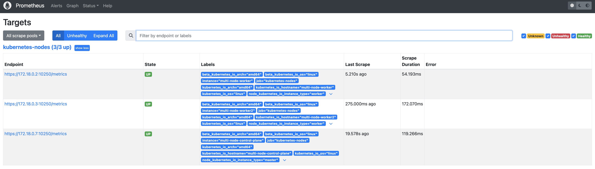

# Addiitonal Scrape Configs

```bash
kubectl create secret generic additional-scrape-configs --from-file=prometheus-additional-configs.yaml  -n monitoring --dry-run=client -oyaml > additional-scrape-configs.yaml
```

```bash
kubectl apply -f additional-scrape-configs.yaml
```

Add following section in Prometheus resource spec

```yaml
additionalScrapeConfigs:
    name: additional-scrape-configs
    key: prometheus-additional-configs.yaml
```

Update clusterrole `prometheus-k8s` to have permission to get/list/watch nodes

```bash
kubectl apply -f prometheus-k8s-cluster-role.yaml
```

```bash
kubectl auth can-i list nodes --as=system:serviceaccount:monitoring:prometheus-k8s
```

If you still error in prometheus pods, restart the prometheus pod after updating clusterrole


 - Refresh prometheus target page it should show pod monitor targets

