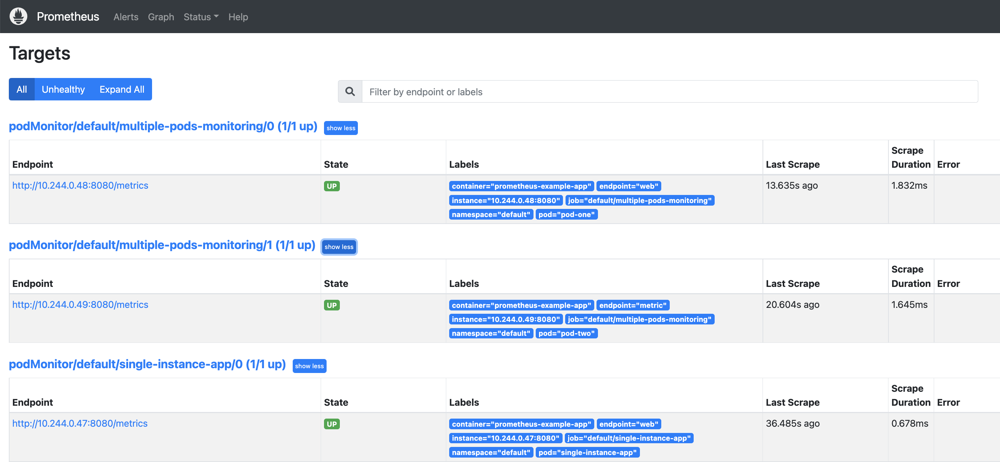

# Pod Monitor

Monitor single or multiple pods

Look at manifest files in respective directories

- Create pod and pod monitors

  ```bash
  kubectl apply -f ./single_pod
  ```

  ```bash
  kubectl apply -f ./multiple_pods
  ```

 - Refresh prometheus target page it should show pod monitor targets

