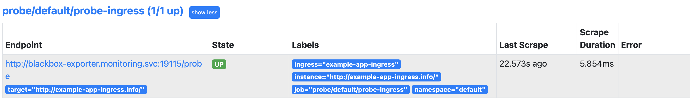

# Probe

- Probe can be used to describe blackbox checks. Inorder to work with probe, blackbox_exporter has to be deployed

- Monitor static targets or ingress

- Look at manifest files in respective directories

## Static Target Monitoring

- Create probe

  ```bash
  kubectl apply -f ./static_target
  ```

- Refresh prometheus target page it should display probe ingress target

  

## Ingress Monitoring

### Pre-requisites

- Deploy Ingress Controller

  If using [minikube](https://kubernetes.io/docs/tasks/access-application-cluster/ingress-minikube/#enable-the-ingress-controller) simply enable ingress addon

  ```bash
  minikube addons enable ingress
  ```

### Monitor Ingress Object

- Deploy app, create service, ingress and probe

  ```bash
  kubectl apply -f ./ingress
  ```
  
- Refresh prometheus target page it should show probe ingress target

  
