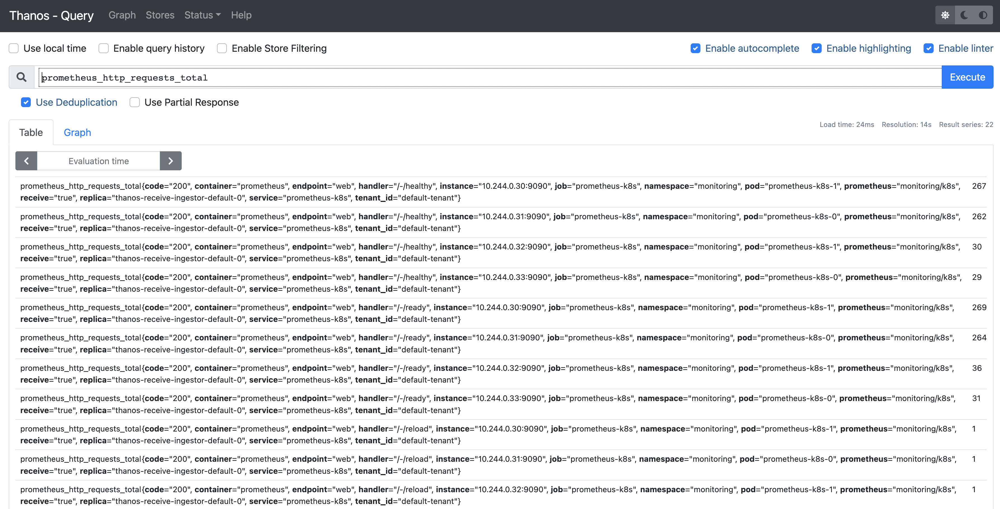
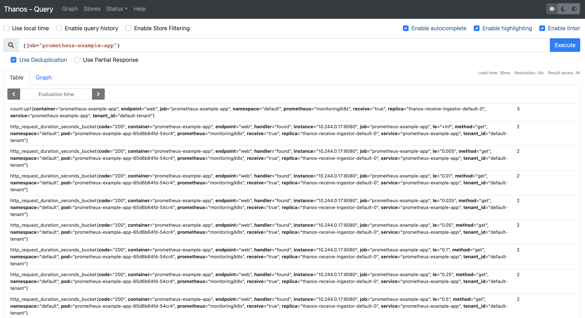

# Configure remote-write to thanos

## Steps

1. Deploy thanos (You can use existing thanos setup if you have, update fields accordingly)

    ```bash
    git clone https://github.com/slashpai/deploy-thanos-kubernetes.git
    cd deploy-thanos-kubernetes
    kubectl apply -f manifests
    ```

2. Configure remote-write

  - Add remoteWrite config to prometheus cr

    ```yaml
    remoteWrite:
      - url: http://thanos-receive-ingestor-default:19291/api/v1/receive
    ```

  - Apply the changes to kubernetes cluster

      ```bash
      kubectl apply -f prometheus.yaml
      ```

3. Wait sometime till new config is rolled out. Once its updated you should be able to see remoteWrite settings in prometheus configuration

4. Check if metrics available in thanos using thanos querier

    ```bash
    kubectl -n default port-forward svc/thanos-query 9091:9090&
    ```

    

    
