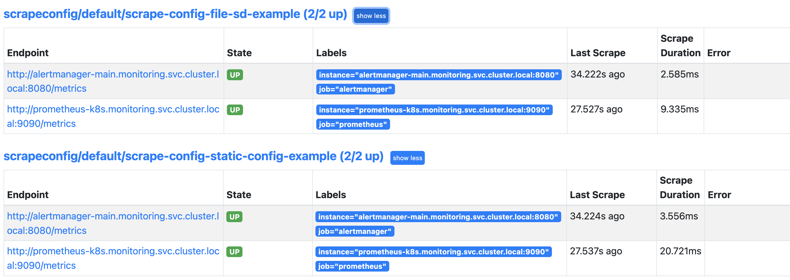

# Scrape Config

Monitor using ScrapeConfig

## staticConfigs

- In the example, I have used in-cluster services (prometheus and alertmanager) as targets. It should work similar for external hosts.
  Another example on external node exporter is also added now.

  ```bash
  kubectl apply -f ./static_config
  ```

## fileSDConfigs

- Deploy configmap to store scrape targets, scrape config using fileSDConfigs, update prometheus object to include configmap and scrape config selector.

- In the example, I have used in-cluster services (prometheus and alertmanager) as targets. It should work similar for external hosts.

  ```bash
  kubectl apply -f ./file_sd
  ```

 - Refresh prometheus target page it should show scrape config targets

    
 