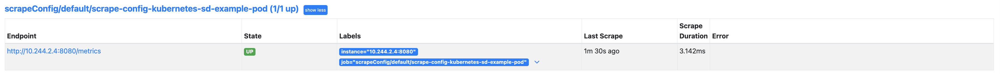

# Scrape Config

Monitor using ScrapeConfig

## staticConfigs

- Available from Prometheus-Operator version `0.65`

- In the example, I have used in-cluster services (prometheus and prometheus-operator) as targets. An external node exporter example is also added.

  ```bash
  kubectl apply -f ./static_config
  ```

 - Refresh prometheus target page it should show scrape config targets

    

## fileSDConfigs

- Available from Prometheus-Operator version `0.65`

- Deploy configmap to store scrape targets, scrape config using fileSDConfigs, update prometheus object to include configmap and scrape config selector.

- In the example, I have used in-cluster services (prometheus and prometheus-operator itself) as targets in one config-map. On another configmap I have used external targets

  ```bash
  kubectl apply -f ./file_sd
  ```

 - Refresh prometheus target page it should show scrape config targets

    

## kubernetesSDConfigs

- Available from Prometheus-Operator version `0.68` and full options added in `0.71`

Look at each scrapeconfig file for various fields used.

  ```bash
  kubectl apply -f ./kubernetes_sd
  ```

 - Refresh prometheus target page it should show scrape config targets

    
    

## consulSDConfigs

- Available from Prometheus-Operator version `0.68`. In example a consul instance is created and a app is registered with consul. Both app and consul is running inside kubernetes but it will work similar for external consul instance as well.

```bash
  kubectl apply -f ./consul_sd
```

- Port forward consul UI

   ```bash
   k port-forward svc/consul 8500
   ```

   

- Refresh prometheus target page it should show scrape config targets

   

## dnsSDConfigs

- Available from Prometheus-Operator version `0.68`

```bash
kubectl apply -f ./dns_sd
```

 - Refresh prometheus target page it should show scrape config targets

    

## ec2SDConfigs

- Available from Prometheus-Operator version `0.69`.

- Attach the policy AmazonEC2ReadOnlyAccess to [IAM Role/User](https://docs.aws.amazon.com/IAM/latest/UserGuide/access_policies_manage-attach-detach.html)

- Create kubernetes secret with api access key and secret key

```bash
kubectl create secret generic aws-api-access --from-literal=accessKey=ACCESSKEY --from-literal=secretKey=SECRETKEY
```

- Create the scrapeconfig (update fields accordingly based on your aws setup)

```bash
kubectl apply -f ./ec2_sd
```

 - Refresh prometheus target page it should show scrape config targets

    
