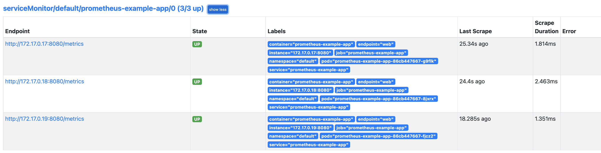

# Service Monitor

Monitor Kubernetes Services

- Deploy app, create service and service monitor

  ```bash
  kubectl apply -f .
  ```

 - Refresh prometheus target page it should show service monitor target

